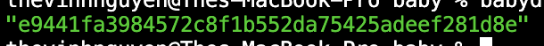

Goal:
* Learners should understand how to monitor vital information of a node

# Lesson 6: Monitoring your node (version, status)

Use:
* "babyd status --help" 
* "babyd version --help"

to learn more

## Guidelines
Monitoring node and version is extremely important for coordination in testnet and mainnet.
* binary version mismatched among validators can lead to consensus break
* a dead node will lead to 10% slashing of delegation (lose big chunk of money)

1. start a baby node
2. babyd status --node tcp://localhost:2281
3. babyd version

## Help videos
https://youtu.be/RW4gZ7O7oPg

## Homework

1. get status of a running baby node
2. use jq to get id in NodeInfo

