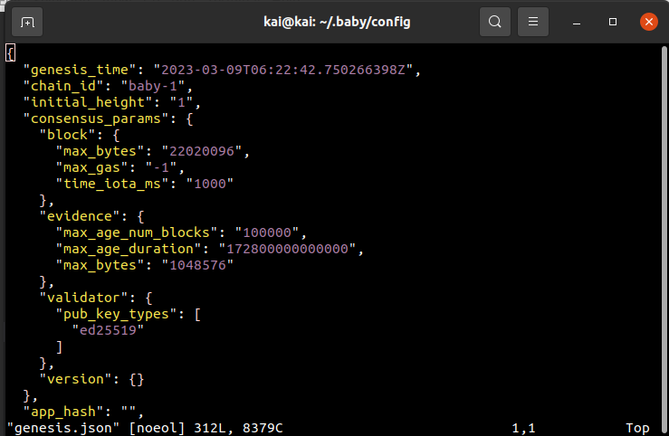

Goal:
* Learners should understand three first params in genesis.json
* Learners should be able to reason and change some params in genesis.json

# Lesson 11: Introduction to genesis.json

genesis.json: a json file that defines the initial state of the chain. This file will contain necessary information related to network identification (chain_id), consensus params, and parameter configuration for keepers.

In this lesson, I will mention 3 information that is genesis_time, chain_id and consensus_param



1. genesis_time: a UTC timestamps which specifies when the blockchain is due to start. At this time, genesis validators are supposed to come online and start participating in the consensus process. The blockchain starts when more than 2/3rd of the genesis validators (weighted by voting power) are online.
```json
  "genesis_time": "2023-03-09T06:22:42.750266398Z",
```

2. chain_id: a unique identifier for your chain. It helps differentiate between different chains using the same version of the software.
```json
 "chain_id": "baby-1",
```

3. consensus_param: defines consensus params for tendermint node. This will affect how Tendermint node behaves. In most case, this should be left alone.

```json
  "block": {
    "max_bytes": "22020096",
    "max_gas": "-1",
    "time_iota_ms": "1000"
  }
```
* There are three sub-params in field "block":
  * max_byte (max numbers of byte / block )
  * max_gas: total gas in a block cannot exceed this limit (if not setup, default is -1)
  * time_iota_ms: minimum time increment between consecutive blocks (in milliseconds).

```json
 "evidence": {
    "max_age_num_blocks": "100000",
    "max_age_duration": "172800000000000",
    "max_bytes": "1048576"
  }
```
* There are three sub-params in field "evidence":
  * max_age_num_blocks: defines the maximum number of blocks after which an evidence is not valid anymore. Ie. if its 1000, and we're at block 5000, only evidence since block 4000 will be considered valid
  * max_age_duration: Max age of evidence, in time. It should correspond with an app's "unbonding period" or other similar mechanism for handling [Nothing-At-Stake attacks]. Read more at (https://github.com/ethereum/wiki/wiki/Proof-of-Stake-FAQ#what-is-the-nothing-at-stake-problem-and-how-can-it-be-fixed)
  * max_bytes: This sets the maximum size of total evidence in bytes that can be committed in a single block and should fall comfortably under the max block bytes. Default is 1048576 or 1MB
  
```json
  "validator": {
    "pub_key_types": [
      "ed25519"
    ]
  }
```
* Validator public key configuration. Each node will have an unique validator public key. Try this command to see node public key

```bash
  babyd tendermint show-validator
```

## Guidelines

1. initialize a node with chain_id = cosmos_boyz
```bash
CHAINID="cosmos_boyz" bash scripts/run-node.sh --install --initialize
```

2. check genesis.json in ~/.baby/config/genesis.json. chain_id field should be cosmos_boyz

3. Run the network
```bash
bash scripts/run-node.sh --continue
```

## Help videos
https://youtu.be/ysOC97kxIuE

## Homework
1. Deploy a node with chain_id "lesson_11" and initial_height=100
2. Run the chain, the chain should start producing first block at 100

3. Make a bank send transaction successfully
