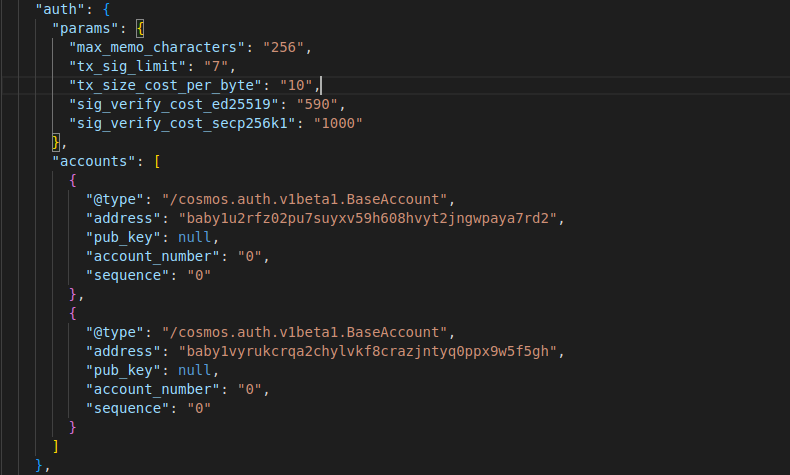
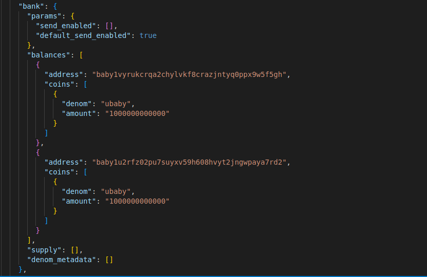
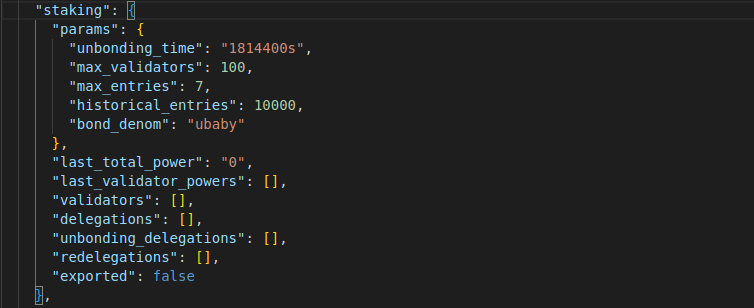
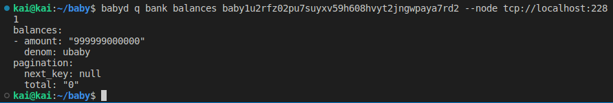

Goal:
* Learners should be able to add new account to auth, add initial balances to bank

# Lesson 12: Dive deep into app_state module configuration (auth, bank, staking)

In this lesson, I will talk about three fields in app_state (auth, bank, staking) in genesis.json.
* app_state: defines the initial state of the state-machine.
* auth: is responsible for specifying the base transaction and account types for an application. Where all basic transaction validity checks(signatures, nonces, auxiliary fields) are performed and show the account keeper, which allows other modules to read, write, and modify accounts.



* bank: includes params and balances for account.



* staking: holders of the native staking token of the chain can become validators and can delegate tokens to validators, ultimately determining the effective validator set for the system.



## Guidelines

1. Initialize a node

```bash 
scripts/test-node-deploy.sh --install --initialize
```

2. Try to find genesis.json in ~/.baby/config. If genesis.json is configured correctly, information should be queryable.
* query genesis account balances: `bash babyd query bank balances [address] [flags]`



## Help videos

https://youtu.be/7XqTr5BBxNs

## Homework
1. Deploy a node with chain_id "lesson_12"
2. Create new genesis account and initial balances to bank successfull using: `babyd add-genesis-account`
3. Query balances of such genesis account