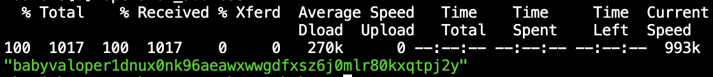

Goal:
* Learners should understand how to make a query through API
* Learners should be able to make a query through API

# Lesson 8: Making a query through API

Browse 'http://localhost:1310' to learn more about query services

## Guidelines
Query helps you to query information on chain or for debugging

1. start a baby node `bash scripts/test-node-deploy.sh --install`
2. make a transaction through CLI
 * babyd tx bank send baby15722a4jxtq7mkahfh93wt3s8skwzt9la50z8qf baby1sfcc725xlcrdsd6ltfqygz8cqh9fg6duqa40au 500000ubaby --fees 30ubaby  --node tcp://localhost:2281
3. query balances of receiver through API
 * curl -X GET "http://localhost:1310/cosmos/bank/v1beta1/balances/baby1sfcc725xlcrdsd6ltfqygz8cqh9fg6duqa40au/by_denom?denom=ubaby" -H  "accept: application/json"
## Help videos
https://youtu.be/zfgvsb7sFpA

## Homework
1. Query all validators and get the first operator address using jq

2. Query number of existing accounts (hint: use jq to get length)

