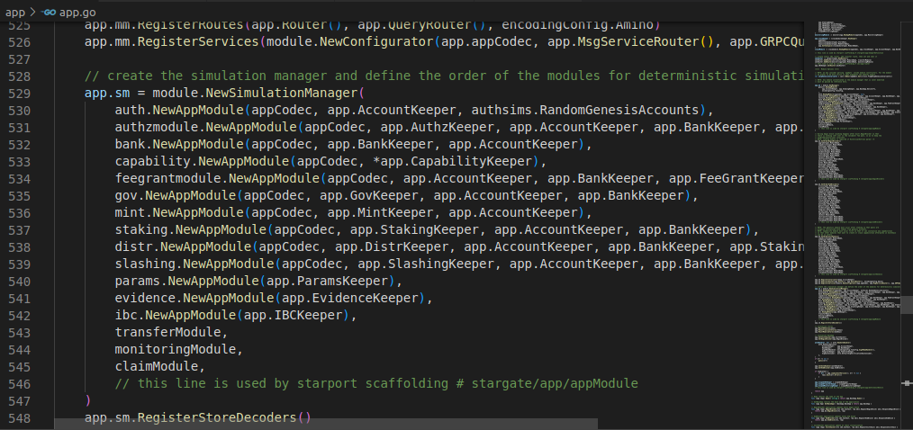

Goal:
* Learners should understand more information about 3 modules in app_state(auth, bank, staking)

# Lesson 12: Dive deeper into app_state module configuration (auth, bank, staking)

app.go: Is the place where all modules for blockchain operation are aggregated.   

In this lesson, I will mention 3 modules that is auth, bank and stake.

## Guidelines

1. Find app.go in ~/baby/app. Look for this paragraph and find the 3 imported modules at the top of the file including: auth, bank and staking. (reused from module 'x' of cosmos-sdk repository)



2. The auth module is responsible for specifying the base transaction and account types for an application. Where all basic transaction validity checks(signatures, nonces, auxiliary fields) are performed and show the account keeper, which allows other modules to read, write, and modify accounts.
* Account: contain authentication information for a uniquely indentified external user of chain. Include public key, address and account number.


* base_account: defines a base account type. It contains all the necessary fields for basic account functionality. Any custom account type should extend this type for additional functionality (e.g. vesting)
```bash
export interface BaseAccount {
  address: string;
  pub_key: Any | undefined;
  account_number: number;
  sequence: number;
}
```

* module_account: defines an account for modules that holds coins on a pool.
```bash
export interface ModuleAccount {
  base_account: BaseAccount | undefined;
  name: string;
  permissions: string[];
}
```


And you can read and practice, you can try the module at https://github.com/cosmos/cosmos-sdk/tree/main/x/auth

3. The bank module : there are two most important functions in this module, which are transaction execution and account balance.

* query account balance: bash babyd query bank balances [address] [flags] 


* transaction: bash babyd tx bank send [from_key_or_address] [to_address] [amount] [flags]


And you can read and practice, you can try the module at https://github.com/cosmos/cosmos-sdk/tree/main/x/bank

4. The staking module: the module enables Cosmos SDK-based blockchain to support an advanced Proof-of-Stake (PoS) system. In this system, holders of the native staking token of the chain can become validators and can delegate tokens to validators, ultimately determining the effective validator set for the system.

* validators: allows users to query details about all validators on a network.

bash babyd query staking validators [flags]


* delegate: allows users to delegate liquid tokens to a validator.

bash babyd tx staking delegate [validator-addr] [amount] [flags]


And you can read and practice, you can try the module at https://github.com/cosmos/cosmos-sdk/blob/main/x/staking/README.md 


## Homework
1. Deploy a node with chain_id "lesson_12"
2. Query authentication accounts successfully
3. Create, edit validator with module staking successfully

