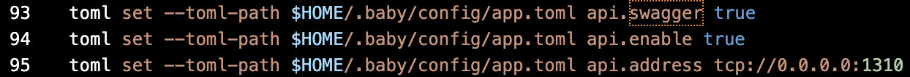

Goal:
* Learners should understand how to config node in app.toml
* Learners should be able to start a node with configured app.toml

# Lesson 9: Enable API server in app.toml

Node configuration consists of three parts:
1. app.toml: configuration for Cosmos side
2. client.toml: configuration for client CLI interaction
3. config.toml: configuration for Tendermint side

Due to complex configuration in config.toml, it will not be covered.

For app.toml, a beginner should only need to know about how to enable API server

## Guidelines

1. initialize a node
2. try to find app.toml in ~/.baby/config. Try to look for this paragraph

3. There are four fields that you need to care about. Explaination is already in the file.
* enable
* swagger
* address
* enabled-unsafe-cors

4. Change it like in [test-node-deploy.sh](../../scripts/test-node-deploy.sh)

5. Browse: "localhost:1310" to check

## Help videos

## Homework
1. Change api server address in app.toml and browse it again to make sure that it is accessible

